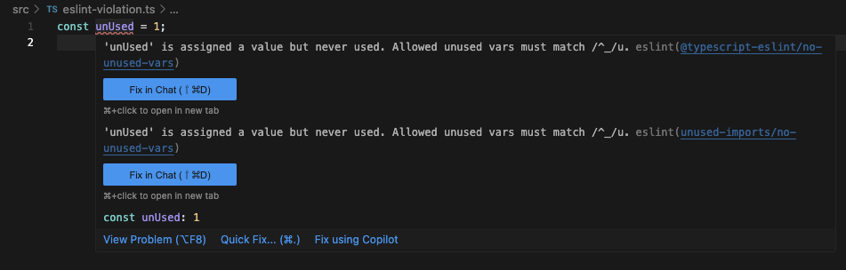

# ESLintで新規コードのみにルールを適応する（Bulk Suppression）

2025/04/05にESLintのv9.24.0が公開されました。

v9.24.0に含まれるBulk Suppression機能が便利そうなので紹介します。

この機能を使うと「プロジェクトの途中からこのルールを追加したいのだけど、既存コードにエラーが多すぎて追加できない」というシーンで、既存コードではエラーを抑制し新しいコードのみエラーを出力することが可能となります。

つまり、新たにルールを追加する際に既存コードでのエラー件数を気にする必要がなくなり、ルール追加のハードルが下げられます。

特に、既存コードを直して回るのが難しい大きめのプロジェクトでは恩恵を受けやすいかと思います。

参考
- 公式ページ：https://eslint.org/docs/latest/use/suppressions

# 機能紹介

ESLintにルールを追加した後で、次のように実行します。

`${rule-name}`には既存コードでは抑制して新規コードから適応したいルール名を渡します。

`--suppress-rule`オプションは複数取れるのでルールを複数指定することも可能だったり、`--suppress-all`オプションで既存コードの全てのエラーを抑制することも可能です。

```sh
eslint --fix --suppress-rule ${rule-name}
eslint --fix --suppress-rule ${rule-name1} --suppress-rule ${rule-name2}
eslint --fix --suppress-all
```

コマンドを実行するとプロジェクトルートに`eslint-suppressions.json`というファイルが出力されます。

このファイルには、ファイルごとにどのエラーが何件抑制されているかが記録されます。

```json
{
  "src/eslint-violation.ts": {
    "no-unused-expressions": {
      "count": 1
    }
  },
}
```

次回以降のESLint実行時にこのファイルの件数と照合することで、新規コードのエラーのみ検出することができます。

また、`--prune-suppressions`オプションで`eslint-suppressions.json`から不要になった抑制を削除することや、`--suppressions-location`で出力・読み込みするJSONファイルも変更できます。

```sh
# eslint-suppressions.json の不要になった抑制を更新する
eslint --prune-suppressions

# eslint-suppressions.json のフォルダを指定する
eslint --fix --suppress-all　--suppressions-location ${file-path}
eslint --suppressions-location ${file-path}
```

# 注意点

## エラー件数しか見ていない

`eslint-suppressions.json`が記録しているのは「どのファイルの、どのルールを、何件抑制するか」という情報のみです。

そのため、既存ファイルを改修し、既存エラーが3つ無くなり新規エラーが1つ増えた、ということはESLintでは検出できません。

既存コードで許容してるルールなのでこれが致命的になることはなさそうですが、こういう事象があることは覚えておくと良さそうです。


## VSCodeでエラー表示される

VSCodeのESLint拡張は未対応で`eslint-suppressions.json`で抑制されているエラーも赤く表示されます。

エラーとして可視化される方がルールが定着しやすいというメリットもありそうですが、量が多いと鬱陶しそうです。

ただし、拡張機能が対応する日もあるかもしれません。


